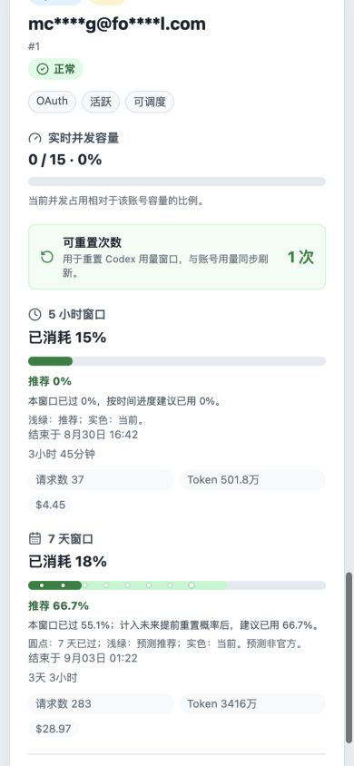

# sub2api upstream status

[English](README.md) | [简体中文](README.zh-CN.md)

Public read-only Next.js panel for selected sub2api upstream account usage windows.

## Preview

### Desktop


### Mobile



## Features

- Read-only public dashboard for selected upstream accounts
- 5 hours and 7 days usage windows with reset time and countdown
- Time-progress recommendations, continuously adjusted by cross-checked early-reset probabilities
- The 7-day usage track overlays current usage (solid), recommended usage (pale green), and elapsed window share (inset circular dots)
- Runtime filtering of visible 5-hour and 7-day usage windows
- 5 hours and 7 days request counts and token usage, both per account and in dashboard summary
- OpenAI subscription plan badges next to each account platform
- Real-time concurrency capacity sync per account
- Available Codex usage-window reset credits per OpenAI OAuth account
- Official OpenAI service status and an independent, clearly labeled community Codex reset forecast
- Frontend auto refresh countdown with a per-browser pause switch
- Automatic language detection with Simplified Chinese, English, and Traditional Chinese
- Automatic time zone detection with a per-browser manual time zone selector
- Automatic light/dark theme detection with a per-browser manual theme selector
- Optional account name masking in the public API and UI

## Scriptable Widget

An iOS Scriptable widget is available at [`scriptable/sub2api-upstream-status-widget.js`](scriptable/sub2api-upstream-status-widget.js). It supports Home Screen and Lock Screen widget sizes. Set the Scriptable widget Parameter to your panel base URL; the script does not include a built-in URL.

## ScriptWidget Widget

A ScriptWidget package is available at [`scriptwidget/sub2api-upstream-status`](scriptwidget/sub2api-upstream-status). Import the package into ScriptWidget and set `widget-param` to your panel base URL. The package does not include a built-in URL.

## Configuration

Create `.env` from `.env.example`.

- `SUB2API_BASE_URL`: sub2api host, with or without `/api/v1`
- `SUB2API_ADMIN_API_KEY`: admin API key sent server-side as `x-api-key`
- `SUB2API_ACCOUNT_IDS`: comma or space separated upstream account IDs to show
- `MASK_ACCOUNT_NAMES`: set to `true` to mask account names in the public API and UI
- `DISPLAY_USAGE_WINDOWS`: visible usage windows, `5h`, `7d`, or `5h,7d` (default)
- `ENABLE_ANNOUNCEMENTS`: show the latest active sub2api announcement, default `true`
- `REFRESH_INTERVAL_SECONDS`: browser polling interval, default `60`
- `OPENAI_STATUS_REFRESH_INTERVAL_SECONDS`: OpenAI Status polling and server cache interval, default `10`
- `OPENAI_STATUS_REQUEST_TIMEOUT_MS`: OpenAI Status request timeout, default `8000`
- `CODEX_RESET_FORECAST_ENABLED`: enable the community early-reset forecast, default `true`
- `CODEX_RESET_FORECAST_SOURCES`: comma-separated source adapters; defaults to all three supported sources
- `CODEX_RESET_FORECAST_REFRESH_INTERVAL_SECONDS`: browser polling and server cache interval, default `120` (range `30-3600`)
- `CODEX_RESET_FORECAST_REQUEST_TIMEOUT_MS`: timeout for each forecast source, default `8000` (range `1000-30000`)
- `CODEX_RESET_FORECAST_MAX_AGE_SECONDS`: maximum source age accepted for calculation, default `1800` (range `300-86400`)
- `NEXT_PUBLIC_PANEL_TITLE`: dashboard title

The admin key is only read by the Next.js server route. It is not returned to the browser.

## Early-reset Forecast

The server cross-checks public JSON feeds from [Codex Runway](https://www.codexrunway.com/api/status.json), [Codex Reset](https://codex-reset.com/api/forecast), and [SaveMeTibo](https://savemetibo.com/status.json). Source freshness and reset-history consistency are validated before weighted probabilities are calculated. Repeated references to the same original post are deduplicated, and a source with an implausibly old last-reset record is excluded.

Forecast requests are made only by this panel server. No sub2api URL, admin key, account name, or account usage is sent to a forecast provider. These are unofficial community estimates and are not an OpenAI commitment.

The base recommendation is simply the elapsed share of the current window: `elapsed time / full window duration`. A valid forecast raises that target using the expected value of the 24-hour and 48-hour early-reset probabilities. An unscoped global forecast affects only the 7-day window; the 5-hour window requires an explicit 5-hour signal. Plan-scoped signals are applied only to matching account plans. Stale, inconsistent, late, or mismatched forecasts leave the time-based recommendation unchanged.

The 7-day window keeps all three readings on one track: solid color shows current usage, pale green shows the recommendation, and inset circular dots mark the elapsed share of the window. The 5-hour track omits the dots to keep short-window scanning compact. The current-usage layer remains green, amber, or red according to consumption level and covers the recommendation beneath it.

## Local Development

```bash
npm install
npm run dev
```

Open `http://localhost:3000`.

## Checks

```bash
npm run typecheck
npm test
npm run build
```

## Docker

```bash
docker compose up -d --build
```

The container listens on port `3000`. If deployed on the same Docker network as sub2api, `SUB2API_BASE_URL` can point at the internal service URL.
