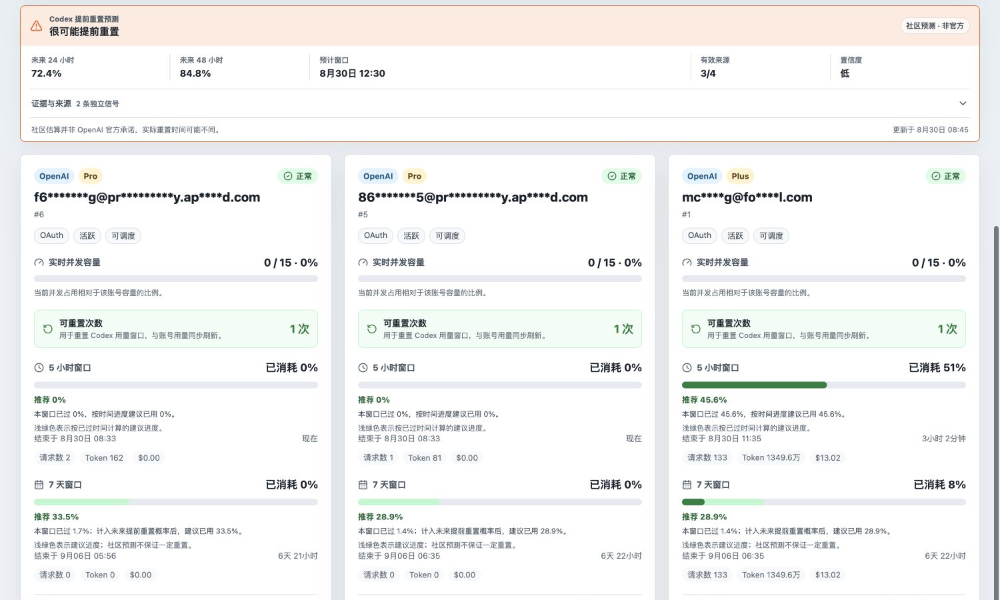

# sub2api upstream status

[English](README.md) | [简体中文](README.zh-CN.md)

Public read-only Next.js panel for selected sub2api upstream account usage windows.

## Preview



## Features

- Read-only public dashboard for selected upstream accounts
- 5 hours and 7 days usage windows with reset time and countdown
- 5 hours and 7 days request counts and token usage, both per account and in dashboard summary
- Real-time concurrency capacity sync per account
- Frontend auto refresh countdown with a per-browser pause switch
- Automatic language detection with Simplified Chinese, English, and Traditional Chinese
- Automatic time zone detection with a per-browser manual time zone selector
- Optional account name masking in the public API and UI

## Scriptable Widget

An iOS Scriptable widget is available at [`scriptable/sub2api-upstream-status-widget.js`](scriptable/sub2api-upstream-status-widget.js). It supports Home Screen and Lock Screen widget sizes. Set the Scriptable widget Parameter to your panel base URL; the script does not include a built-in URL.

## ScriptWidget Widget

A ScriptWidget package is available at [`scriptwidget/sub2api-upstream-status`](scriptwidget/sub2api-upstream-status). Import the package into ScriptWidget and set `widget-param` to your panel base URL. The package does not include a built-in URL.

## Configuration

Create `.env` from `.env.example`.

- `SUB2API_BASE_URL`: sub2api host, with or without `/api/v1`
- `SUB2API_ADMIN_API_KEY`: admin API key sent server-side as `x-api-key`
- `SUB2API_ACCOUNT_IDS`: comma or space separated upstream account IDs to show
- `MASK_ACCOUNT_NAMES`: set to `true` to mask account names in the public API and UI
- `REFRESH_INTERVAL_SECONDS`: browser polling interval, default `60`
- `OPENAI_STATUS_REFRESH_INTERVAL_SECONDS`: OpenAI Status polling and server cache interval, default `10`
- `OPENAI_STATUS_REQUEST_TIMEOUT_MS`: OpenAI Status request timeout, default `8000`
- `NEXT_PUBLIC_PANEL_TITLE`: dashboard title

The admin key is only read by the Next.js server route. It is not returned to the browser.

## Local Development

```bash
npm install
npm run dev
```

Open `http://localhost:3000`.

## Checks

```bash
npm run typecheck
npm test
npm run build
```

## Docker

```bash
docker compose up -d --build
```

The container listens on port `3000`. If deployed on the same Docker network as sub2api, `SUB2API_BASE_URL` can point at the internal service URL.
