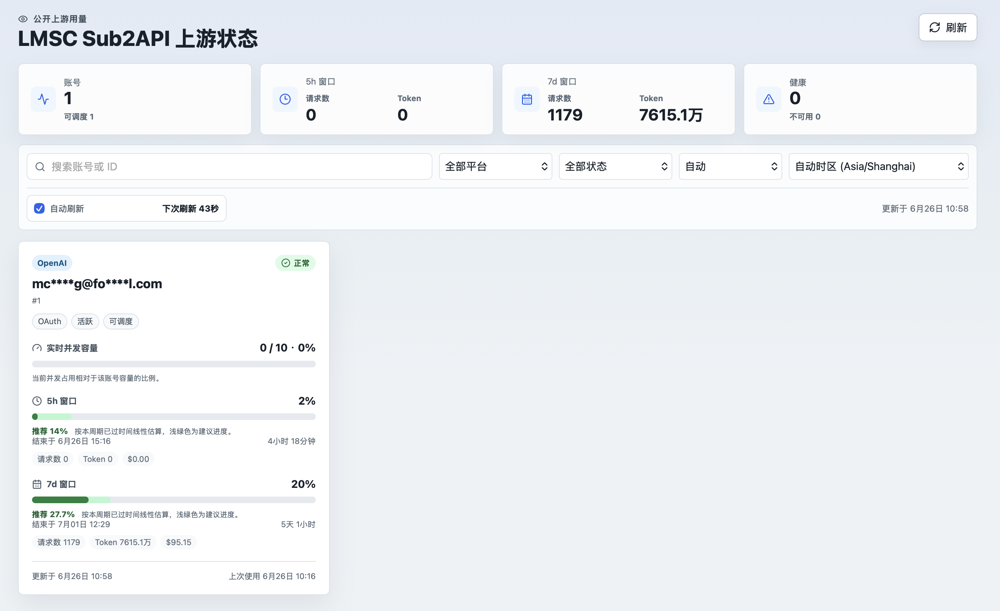

# sub2api upstream status

[English](README.md) | [简体中文](README.zh-CN.md)

面向指定 sub2api 上游账号的公开只读 Next.js 面板，用于查看额度窗口和窗口内使用量。

## 展示图



## 功能

- 公开只读面板，无需登录即可查看选定上游账号状态
- 展示 `5h` 与 `7d` 用量窗口、窗口结束时间和倒计时
- 展示 `5h` 与 `7d` 两个窗口内的请求数和 Token 消耗，包含账号级和顶部汇总
- 每个账号的实时并发容量同步
- 前端自动刷新，显示剩余刷新时间，并支持按浏览器单独暂停
- 自动检测用户语言，支持简体中文、英文、繁体中文
- 自动检测用户时区，并支持按浏览器手动切换时区
- 支持通过环境变量对公开面板中的账号名做模糊处理

## 配置

基于 `.env.example` 创建 `.env`。

- `SUB2API_BASE_URL`：sub2api 地址，可以带或不带 `/api/v1`
- `SUB2API_ADMIN_API_KEY`：服务端请求 sub2api admin API 时使用的 `x-api-key`
- `SUB2API_ACCOUNT_IDS`：要展示的上游账号 ID，支持逗号或空格分隔
- `MASK_ACCOUNT_NAMES`：设为 `true` 时，在公开 API 和前端 UI 中模糊账号名
- `REFRESH_INTERVAL_SECONDS`：浏览器轮询刷新间隔，默认 `60`
- `NEXT_PUBLIC_PANEL_TITLE`：面板标题

admin key 只在 Next.js 服务端路由中读取，不会返回给浏览器。

## 本地开发

```bash
npm install
npm run dev
```

打开 `http://localhost:3000`。

## 检查

```bash
npm run typecheck
npm test
npm run build
```

## Docker

```bash
docker compose up -d --build
```

容器监听 `3000` 端口。如果与 sub2api 部署在同一个 Docker 网络中，`SUB2API_BASE_URL` 可以直接指向 sub2api 的内部服务地址。
